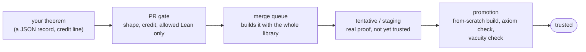

<!-- DRAFT of the library's README, for review. Not yet the README. See messaging-draft.md (the wording every surface should share)
     and consistency-audit-draft.md (what is inconsistent today). Counts are placeholders for the live badges / data/stats.json. -->

<h1 align="center">Tengoku (天国)</h1>

<b>Formal mathematics from many projects, in one verified Lean 4 library.</b> 
So AI provers, and the people who work with them, can search everything already proven and trust what they find.

[Lean 4 toolchain badge] [trusted theorems badge] [DOI badge]

---

## Try it now (pick one, 60 seconds)

| You want to… | Do this | You get |
|---|---|---|
| **Search in a browser** | open [competemath.com/tengoku](https://competemath.com/tengoku), type `sum of two squares` | theorems matched by meaning or by type, each marked **trusted** or **tentative**, with a link to its source |
| **Give an AI agent the library** | `claude mcp add --transport sse leak-i https://barkingtree-leak-i.hf.space/sse` (no sign-up, no key) | your agent can look up lemmas in the whole library while it proves |
| **Query it from code** | `curl 'https://competemath.com/api/tengoku/search?q=Nat.add_comm'` ([API](docs/api.md)) | JSON: statement, status, library, source link |
| **Check a proof or explore proof states** | add the Leak IV verifier (`https://barkingtree-leak-iv.hf.space/sse`) and Leak II, the interactive proof-state service (`https://barkingtree-leak-ii.hf.space/sse`), to the same MCP client | your agent compiles a whole Lean script against the library, or steps through a proof tactic by tactic |
| **Build against it** | `git clone https://github.com/competemath/tengoku && cd tengoku && scripts/cache.sh get` | the verified, already-compiled library: nothing to build from scratch; then `import Tengoku.All` |

<!-- VIDEO (45 s), storyboard: 1) the search page, type "sum of two squares"; 2) a result opens: the TRUSTED badge, the source link;
     3) an agent session calling Leak I for a lemma; 4) the one-line `scripts/cache.sh get`. Record, upload to the release, embed here. -->

## The problem

| Today | With Tengoku |
|---|---|
| Formal mathematics is scattered over hundreds of projects, each pinned to its own Lean version. Using two of them together means fighting version and dependency conflicts. | One toolchain and one dependency set. Libraries are **translated** onto it, and every translated theorem keeps a link to its original. |
| An AI prover that wants a lemma has to know which project holds it, at which version. Most of what already exists is invisible to it. | One library to search, by meaning or by type shape, from a browser, an HTTP call or an agent. |
| "Is this proof really valid?" depends on each project's own standards. A theorem can even be vacuous: its assumptions contradict each other. | One definition of **trusted**: the library builds with the theorem, it uses no `sorry` and only the standard axioms, and its assumptions are checked not to contradict. |
| Copying code loses authorship and licences. | Every record carries its source at a fixed commit, its licence and its credit. Nothing is deleted; a mistake is retracted, with the reason. |
| Contributing means waiting for line-by-line review. | Anyone can contribute, by hand or with AI. Machines check the mathematics; a maintainer approves each change. |

## Why the services matter: a measured case

Tengoku's search and verification services (the Leak MCP services above) are what let an agent use the library while it proves. They were measured on [FATE-X](https://arxiv.org/abs/2411.14052), a benchmark of graduate-level algebra problems in Lean 4, with the same model (Claude Sonnet 5), the same time budget and no web search:

| Same agent, given… | Proved |
|---|---|
| **no Leak tools**, only told whether each whole attempt compiled | **1 of 42** problems attempted |
| **the Leak IV compiler and the Leak I library search** | **38 of 98** problems (38.8%) |

The no-tools arm was stopped after 42 problems, so the two rows count different numbers of problems. This was measured on Mathlib at Lean v4.29.1, before Tengoku. [Full report: TODO link once published]. The same measurement is planned again on Tengoku after it has grown, so the difference the library makes is measured, not claimed.

<!-- CHECK BEFORE PUBLISHING: (1) the FATE-X link is the right paper; (2) hosted Leak I/II/IV now serve Tengoku (a Tengoku-only declaration resolves on each); (3) the report is public; (4) say nothing about Leak II's benefit: no completed run isolates it (Control IV). -->

## How a theorem earns trust

Every step is code in this repository, named in [what Tengoku guarantees](docs/why-tengoku.md).

## What is inside

- **Mathlib** and its dependencies, as the base, plus translated research libraries (Carleson, PrimeNumberTheoremAnd, Brownian motion, the IMO Shortlist and more), competition solutions and CompeteMath's own problems.
- Numbers, always live: the trusted-theorem badge above and [`data/stats.json`](data/stats.json).
- Not a replacement for Mathlib: Mathlib is curated by human review; Tengoku adds what Mathlib does not hold and checks it by machine.

## Who it is for

| If you are… | Start here |
|---|---|
| building or training an **AI prover or agent** | [Leak I (MCP)](docs/api.md), [the search API](docs/api.md) |
| a **Lean user** who needs a result from another project | the browser search, then `scripts/cache.sh get` |
| a **researcher** | the dataset releases and their [DOI](https://doi.org/10.5281/zenodo.23050400), [how to cite](#how-to-cite) |
| **contributing** a theorem or a whole library | [CONTRIBUTING.md](CONTRIBUTING.md) |

## Contribute

Anyone can, by hand or with AI. Verification is automatic; credit is permanent (an `Author:` line naming the human and any AI used, which no later change can remove).
Start with [CONTRIBUTING.md](CONTRIBUTING.md); how a change moves is in [how a PR flows](docs/how-a-pr-flows.md); what people want next is in [GOALS.md](GOALS.md).

## How to cite
[unchanged from the current README]

## Dedication
[unchanged: the dedication of the current README]

## Badges
[unchanged: the other badges]
