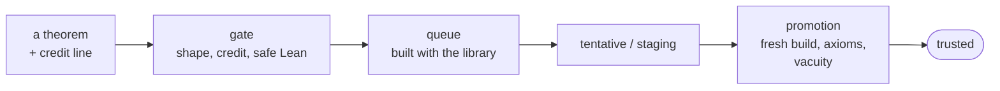

<h1 align="center">Tengoku (天国)</h1>

<b>Every formal proof, one Lean 4 library, machine-checked.</b>

[Lean toolchain badge] [trusted theorems badge]

Formal mathematics is growing fast, but it lives in hundreds of separate Lean projects, each pinned to its own version of Lean, so they cannot be used together and an AI prover cannot even find what already exists. Tengoku brings them into **one library on one toolchain**, checks every theorem by machine, and keeps each theorem's source, licence and credit.

## Try it (60 seconds)

| | |
|---|---|
| **Search** | [competemath.com/tengoku](https://competemath.com/tengoku): type `sum of two squares` |
| **Agents** | `claude mcp add --transport sse leak-i https://barkingtree-leak-i.hf.space/sse` |
| **Code** | `curl 'https://competemath.com/api/tengoku/search?q=Nat.add_comm'` |
| **Lean** | `git clone https://github.com/competemath/tengoku && cd tengoku && scripts/cache.sh get` |

## What it fixes

| Today | With Tengoku |
|---|---|
| Libraries pin different Lean versions; combining two is a research project. | One toolchain. Libraries are translated onto it; every theorem links to its original. |
| A prover cannot see what exists outside Mathlib. | One library to search by meaning or by type, from browser, HTTP or agent. |
| "Proved" can mean vacuous, or resting on `sorry`. | **Trusted** means: builds with the library, no `sorry`, standard axioms only, assumptions not contradictory. |
| Copying loses authorship and licences. | Every record carries source, licence and credit. Nothing is deleted. |

## How a theorem is trusted

## Measured

With the same model and budget, an agent with Tengoku's compiler gate and library search proved **38 of 98** graduate algebra problems ([FATE-X](https://github.com/frenzymath/FATE-X)); with no tools, **1 of 42** (stopped early).

## Status

| | |
|---|---|
| **Today** | Mathlib and its dependencies, translated research libraries, search, verifier, nightly builds, monthly dataset releases with a DOI |
| **Next** | translating the remaining registered libraries; measuring again after growth |
| **Later** | a library every new Lean release follows |

## Contribute · Cite

Anyone can, by hand or with AI: [CONTRIBUTING.md](CONTRIBUTING.md). Credit is permanent. Cite: [DOI 10.5281/zenodo.23050400](https://doi.org/10.5281/zenodo.23050400).

## Dedication · Badges
[as in tengoku #246]
