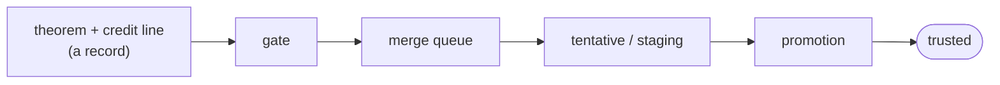

# How a theorem becomes trusted, and what that does and does not mean (draft)

This page defines the words the README uses, step by step, and says plainly what each check cannot do.

## The words

| Word | Meaning |
|---|---|
| **record** | one theorem (or definition) in the library's data files: its Lean statement and proof, the source it came from (a link at a fixed commit), its licence, and its credit |
| **tier** | where a record stands: **tentative**, **staging** or **trusted** |
| **tentative** | a real proof from a real source, indexed and searchable, not yet translated or re-checked here |
| **staging** | translated onto the library's toolchain and accepted by the translation checks, awaiting promotion |
| **trusted** | built into the library and passed every check below |
| **gate** | the checks that run on every pull request, before anything is merged |
| **merge queue** | the step that builds a change together with the whole library before it can merge |
| **promotion** | the step that moves a record from staging to trusted, after a fresh build and two more checks |
| **translation** | rewriting a theorem from the Lean version it was proved on to the library's version, by an automated pipeline that is partly driven by an AI agent; checked twice (below) |

## The path

1. **Gate.** The record has the right shape; its source is on the list of accepted sources (with their licences); it carries an `Author:` line naming the human and any AI used; its Lean uses only constructs on an allow-list (no code that runs when the library compiles); it contains no secrets. Every pull request passes through it, the maintainer's included.
2. **Merge queue.** The new modules are built together with the whole compiled library, with every named declaration checked for `sorry` and for any axiom beyond `propext`, `Classical.choice` and `Quot.sound`.
3. **Translation checks** (for records translated from another Lean version). Check one: the translated script compiles in the library's environment with no errors, no warnings and no `sorry`. Check two: the original theorem is replayed from an export of its own module into the same environment, and the kernel accepts that the translated statement implies the original, so the translation proves at least what the original did.
4. **Promotion.** A fresh build of the record's module against the compiled library, the axiom check again, and a **vacuity** check: the theorem's hypotheses are tested for contradiction, and a theorem from which `False` follows is refused unless a person acknowledges it with a reason.
5. **Nightly independent check.** Every declaration of the compiled library (745,847 today, from a 110-million-line export) is checked again by [nanoda](https://github.com/ammkrn/nanoda_lib), a type checker written separately from Lean, and a separate program computes the axioms every constant rests on.

## What "trusted" does not mean

- **Not that the statement says what its source says.** The kernel checks that a proof proves a statement; nothing here checks that the statement faithfully encodes the informal claim. Translation adds one more place for this to go wrong. (An [audit](https://arxiv.org/abs/2606.29493) of five widely used Lean benchmarks found exactly this kind of defect.)
- **Not that a translation is equivalent to its original.** Check two shows the translated statement implies the original; it can be stronger. Lean and Mathlib change meanings between versions, which is why each theorem keeps a link to its original.
- **Not that the vacuity check is complete.** It finds hypotheses from which `False` can be derived; it cannot prove that hypotheses are satisfiable.
- **Not that the second checker covers everything.** nanoda checks the exported declarations, so it guards against a bug in Lean's kernel; it does not check the elaborator or the statement.
- **Not that a person reviewed it.** Mathlib's line-by-line review is a stronger and different standard. Tengoku builds on Mathlib and does not claim to replace it; anything Mathlib-suitable belongs upstream.

## What is kept

Records are append-only. A mistake is retracted by a tombstone with a category (duplicate, incorrect, superseded, licence, other) and a note; credit changes only on documented evidence of plagiarism. Copyleft sources are not accepted, and a source whose licence is found incompatible is removed.
