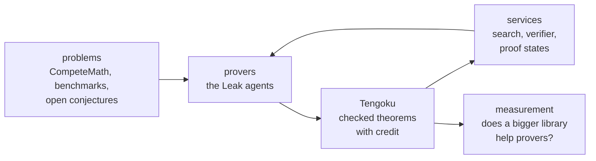

# Vision (draft)

What Tengoku is for, where it is going, and what is real today. Each item says which it is: **today**, **in progress**, **planned**, or **an idea**. Nothing is promised that is not labelled.

## The problem, in one paragraph

Formal mathematics is one of the few places where a result can be machine-checked end to end, and the amount of it is growing quickly. But it grows in separate Lean projects, each pinned to its own Lean version, each with its own conventions, and Lean itself changes between versions in ways that break old code. The consequence is waste: a theorem proved in one project cannot be used in another, a prover cannot know what already exists, and every benchmark or training set has to be assembled again by hand, with defects that are only found later (vacuous statements, missing hypotheses). Tengoku exists to remove that waste for the people and the machines that do formal mathematics.

## Why now

The largest funder of AI for mathematics describes its second round of awards as a balance of moonshots, field-building, "benchmarks and datasets to track progress, and infrastructure that empowers mathematicians" ([Renaissance Philanthropy's AI for Math Fund](https://www.renaissancephilanthropy.org/ai-for-math-fund-2026-projects)): the same needs this project works on. The Lean community describes the cost of churn directly: Mathlib users face renamed lemmas, changed imports and breaking changes, and tooling to test a Lean change against dependent projects does not yet exist ([Lean mathlib maintenance](https://arxiv.org/abs/2508.21593)). A library that absorbs that churn once, for everyone downstream, is the part nobody else is building.

## What Tengoku wants to be

**The shared, always-current memory of formal mathematics.** One library that a prover, an agent or a person can search, import and rely on, that keeps up with Lean instead of getting stuck on an old version, and in which every theorem says where it came from, who proved it, and how it was checked.

Three commitments, each already visible in the code:

1. **Checked by machine, not by reputation.** Trust is a property a theorem earns by passing gates that anyone can read, never one that depends on who submitted it. *(today)*
2. **Nothing is lost.** Records are append-only; mistakes are retracted with a reason; credit is permanent, and AI help is named. *(today)*
3. **Measured, including against ourselves.** Claims about what the library does for provers are measured and published, with the results that went the wrong way. *(today, once the report is public: the first report's headline result was that our own decomposition pipeline lost to a simpler agent)*

## The loop it belongs to

Tengoku is one part of a loop that one developer is building end to end, and the loop is what makes it more than a mirror:

| Part | Status |
|---|---|
| Problems come in (CompeteMath publishes one every week; sources such as Formal Conjectures are registered) | *today* |
| Provers use the services while they prove (measured once, before Tengoku) | *today* |
| Services run over Tengoku and re-sync after every nightly build | *today* |
| Checked proofs from provers enter Tengoku with credit | *partly*: contributions and translations enter; a prover's new proofs are not yet fed back automatically |
| The same measurement repeated as the library grows | *planned* |

## Where it is going

| | | |
|---|---|---|
| **A library that follows Lean** | When a new Lean release lands, the translation pipeline moves everything onto it, so the library is never the thing that holds a project back. Today the library is on one pinned toolchain and a pipeline translates sources onto it. | *in progress* |
| **All registered sources translated** | Of the sources registered, those with a corpus are being translated; the rest are data-only. The first goal in `GOALS.md`. | *in progress* |
| **A public record of what the library does for provers** | The same benchmark, repeated as the library grows, published each time: does a bigger, better-checked library make provers better, and by how much? The first measurement exists; the second is planned for after growth. | *planned* |
| **Fresh problems that nobody has trained on** | Competition-style problems formalised before their solutions are public (CompeteMath publishes a new problem every week), with a time stamp, so a prover's score cannot come from memorisation. | *an idea* |
| **A bridge from open problems to proofs** | Sources such as Google DeepMind's Formal Conjectures hold statements of open problems. When any prover, human or AI, proves one, the proof enters the library with its credit. | *an idea* |
| **A *reviewed* tier** | The gap named most often about machine-checked mathematics is faithfulness: the kernel checks that a proof proves a statement, not that the statement says what its source says. A fourth tier, *reviewed*, would mean a person (or an independent reviewer, with the review recorded) confirmed the statement against its source. Most useful first for the theorems benchmarks and provers lean on. | *an idea* |
| **Theorems readable by non-Lean people** | An informal sentence beside each Lean statement, labelled as generated, so a mathematician who has never used Lean can see what a result says and decide whether it is the one they want. | *an idea* |
| **A flywheel** | Every proof an agent finds enters the library with the AI credited, so the next agent starts richer than the last. The pieces exist (the services, the gates, the credit line); the loop is not yet closed automatically. | *an idea* |

## The next steps, concretely

Each is checkable; none depends on a date being met.

1. **Close the known gaps.** Move CompeteMath's 262 records out of *trusted* until they are built in; account for the Mathlib index records the nightly check does not match by name; regenerate `data/stats.json` and the coverage table nightly instead of after a promotion.
2. **Promote the staged libraries**, starting with the largest (IMO Shortlist, physlib, formal-mathfin, FLT, Carleson), and say how many of each library's theorems promoted.
3. **Publish the evidence**: the benchmark report, then the matched before-and-after run on Tengoku.
4. **Show the library following Lean**: when the next Lean release candidate lands, move the library onto it and publish how long it took and what broke.
5. **Pilot the *reviewed* tier** on a small set (for instance the problems a benchmark uses), with each review recorded.

## What Tengoku is not trying to be

- A replacement for Mathlib. Mathlib is the curated centre; Tengoku adds what it does not hold, checked by machine.
- A new proof assistant, or a library for assistants other than Lean (for now).
- A guarantee that a formal statement says what its informal source says. Faithfulness of a statement is a separate question that this library does not answer.
- A product. The library, its data and its checks are open, with no plan to charge for them; the Leak provers and CompeteMath are separate projects by the same developer.

## Who is building it

Tengoku is built by one independent developer, with AI assistance named wherever it was used, and anyone can contribute. That is why the gates are automatic and public, why the project is conservative about what it claims, and why it says so when something is not done.

## If the maintainer stops

Tengoku is built so that it can outlive its author: the library, the data, the checks and the nightly builds are in the open repository under Apache-2.0 with per-record upstream licences; the services' code is public and can be run by anyone ([leak-services](https://github.com/mikael-bashir/leak-services)); every release is archived with a DOI. A fork can keep running the same checks. What would be lost is the translation pipeline's day-to-day operation, which is where help is most needed.

## What would make this a success

- A prover or an agent that starts from Tengoku does measurably better than one that starts from Mathlib alone.
- A Lean user needing a theorem from another project finds it, imports it, and trusts it in a minute.
- New benchmarks are built on a library whose statements were checked for vacuity, rather than assembled again from scratch.
