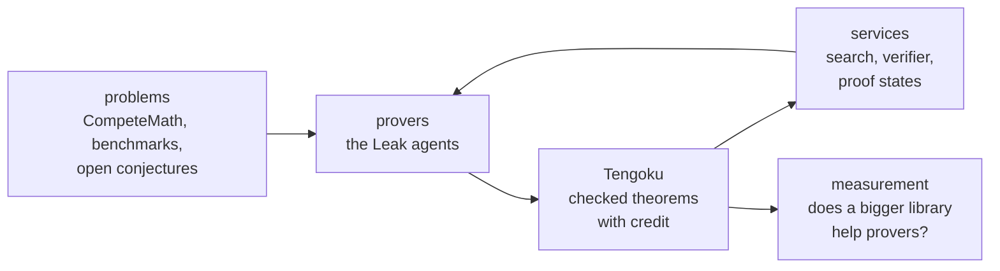

# Vision (draft)

Tengoku wants to be the shared, always-current memory of formal mathematics. This page says what that means, why it is hard, and how far along each part is: *today*, *in progress*, *planned* or *an idea*.

## The problem

Formal mathematics grows in separate Lean projects, each pinned to its own Lean version and its own copy of Mathlib, and Lean changes between versions in ways that break old code. A theorem proved in one project cannot be used in another, a prover cannot know what already exists, and every benchmark or training set is assembled again by hand, with defects found only later: vacuous statements, missing hypotheses, names that no longer resolve.

## Why translation is hard

Moving a project onto one Lean version is the core of Tengoku, and two things make it hard.

**Entailment.** A translated theorem must still say what the original said. Compiling is not enough: a translation can compile and quietly prove something weaker, because a definition changed or a hypothesis was dropped. Tengoku asks the kernel to accept `fun h => h : translated → original`, so the translated statement must imply the original. That check is strict, and it fails whenever the two statements differ by definitions the kernel cannot see through. It shows that a translation proves at least what the original proved; it does not show the two mean the same.

**Self-containment.** A project is not a list of theorems. Its theorems lean on its own definitions, tactics, options, generated files and pinned dependencies, all fixed to one toolchain. To compile one theorem on another toolchain, everything it depends on has to come along, names have to be reconciled with Mathlib and with the other libraries in the tree (identical declarations are kept once, differing ones renamed), and the result has to build as a whole. Translating a whole library at a time works far better than translating theorems one by one, which is why the pipeline works that way.

The pipeline is partly driven by an AI agent. Whether anything is trusted is decided by the checks, never by the agent.

## What Tengoku wants to be

One library that a prover, an agent or a person can search, import and rely on; that keeps up with Lean instead of getting stuck on an old version; and in which every theorem says where it came from, how it was checked and who proved it.

Three commitments, two in force today:

1. **Checked by machine, not by reputation.** A theorem earns trust by passing gates anyone can read, whoever submitted it. *(today)*
2. **Nothing is lost.** Records are append-only; a mistake is retracted with a reason; credit changes only on documented evidence; AI help is named. *(today)*
3. **Measured, including against ourselves.** Claims about what the library does for provers are measured and published, including the results that went the wrong way. *(in progress: the first report's headline result was that our own decomposition pipeline lost to a simpler agent; the report is not yet public)*

## Mathlib and Tengoku

Mathlib is the curated centre of Lean mathematics, and it is shaped for people writing proofs: when the community finds a better statement, a better name or a cleaner interface, the old one is refactored and deprecated. That is right for human proofs and fragile for provers. A theorem prover, or a training set, that learned a lemma by its name and shape finds it gone after the next update.

Tengoku keeps what was proved. Theorems keep their names, and a retracted theorem stays behind as a tombstone whose note says how to prove the same idea: the theorem that is equivalent, or the steps to take (use Y, then Z). A prover that reaches for a statement that has gone is redirected rather than broken. Tombstone notes with a `see` list of replacements are in the data model today *(today)*; carrying the same text into the docstring of the generated Lean declaration is *planned*.

Tengoku carries a pinned copy of Mathlib, so the two do not compete: what belongs in Mathlib belongs upstream, and Tengoku adds the projects around it. Both together are the memory: Mathlib for what the community curates, Tengoku for everything that was proved and must not stop working.

## The loop it belongs to

Tengoku is one part of a loop, and the loop is what makes it more than a mirror:

| Part | Status |
|---|---|
| Problems come in (CompeteMath publishes one every week; sources such as Formal Conjectures are registered) | *today* |
| Provers use the services while they prove (measured once, before Tengoku) | *today* |
| Services run over Tengoku and re-sync after every nightly build | *today* |
| Checked proofs from provers enter Tengoku with credit | *in progress*: contributions and translations enter; a prover's new proofs are not yet fed back automatically |
| The same measurement repeated as the library grows | *planned* |

## Where it is going

| | | |
|---|---|---|
| **A library that follows Lean** | When a new Lean release lands, the translation pipeline moves everything onto it, so the library is never what holds a project back. Today it sits on one pinned toolchain, and a pipeline translates sources onto it. | *in progress* |
| **All registered sources translated** | Sources with a corpus are being translated; the rest are data-only. The first goal in `GOALS.md`. | *in progress* |
| **A public record of what the library does for provers** | The same benchmark, repeated as the library grows and published each time: does a bigger, better-checked library make provers better, and by how much? The first measurement exists; the second comes after growth. | *planned* |
| **Fresh problems nobody has trained on** | Competition-style problems formalised before their solutions are public, with a time stamp, so a prover's score cannot come from memorisation. | *an idea* |
| **A bridge from open problems to proofs** | Sources such as Google DeepMind's Formal Conjectures hold statements of open problems. When any prover, human or AI, proves one, the proof enters the library with its credit. | *an idea* |
| **A *reviewed* tier** | The kernel checks that a proof proves a statement, not that the statement says what its source says. A fourth tier would mean a person, or an independent reviewer, confirmed the statement against its source, with the review recorded. Most useful first for the theorems that benchmarks and provers lean on. | *an idea* |
| **Theorems readable without Lean** | A sentence in plain language beside each Lean statement, labelled as generated, so a mathematician who has never used Lean can see what a result says. | *an idea* |
| **A flywheel** | Every proof an agent finds enters the library with the AI credited, so the next agent starts richer than the last. The pieces exist (the services, the gates, the credit line); the loop is not yet closed automatically. | *an idea* |

## Next steps

1. **Close the known gaps.** Move CompeteMath's 262 records out of *trusted* until they are built in; account for the Mathlib index records the nightly check does not match by name; regenerate `data/stats.json` and the coverage table nightly instead of after a promotion.
2. **Promote the staged libraries**, starting with the largest (IMO Shortlist, physlib, formal-mathfin, formal-math, tauceti), and report how many of each library's theorems promoted.
3. **Publish the evidence:** the benchmark report, then the matched before-and-after run on Tengoku.
4. **Show the library following Lean:** when the next Lean release candidate lands, move the library onto it and publish how long it took and what broke.
5. **Pilot the *reviewed* tier** on a small set, for instance the problems a benchmark uses.

## Why now

The largest funder of AI for mathematics describes its second round of awards as a balance of moonshots, field-building, "benchmarks and datasets to track progress, and infrastructure that empowers mathematicians" ([Renaissance Philanthropy's AI for Math Fund](https://www.renaissancephilanthropy.org/ai-for-math-fund-2026-projects)). The Lean community describes the cost of churn directly: Mathlib users face renamed lemmas, changed imports and breaking changes, and tooling to test a Lean change against dependent projects does not yet exist ([Lean mathlib maintenance](https://arxiv.org/abs/2508.21593)). A library that absorbs that churn once, for everyone downstream, is the part nobody else is building.

## What it is not

- A replacement for Mathlib (see above).
- A new proof assistant, or a library for assistants other than Lean, for now.
- A guarantee that a formal statement says what its informal source says. That is a separate question, and the *reviewed* tier is the proposed way to answer it.

## Who runs it

Tengoku is a community-maintained project, founded by an independent developer. Anyone can contribute, by hand or with AI; AI help is named on the contribution.

## What stays fixed

Whoever runs the project, these stay as they are:

- The library, its data and its checks are open under Apache-2.0, and every record keeps its upstream licence.
- Releases already published stay open and stay archived, each with its own DOI.
- Data files are append-only, and credit changes only on documented evidence.
- The services' code is public ([leak-services](https://github.com/mikael-bashir/leak-services)), and the nightly checks can be re-run by anyone.

A fork can keep running the same checks. What the library needs most is people to run the translation pipeline, which takes compute and model usage.

## What would make this a success

- A prover or an agent that starts from Tengoku does measurably better than one that starts from Mathlib alone.
- A Lean user who needs a theorem from another project finds it, imports it and trusts it in a minute.
- New benchmarks are built on a library whose statements were checked for vacuity, not assembled again from scratch.
